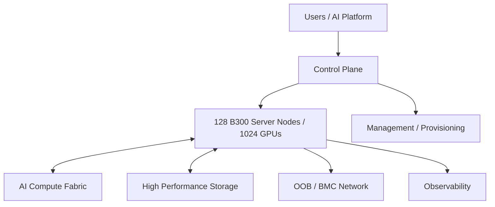

# 01｜128 节点总体架构

> 核对日期：2026-10-04。这里的“128 台 B300”指 128 台 8-GPU B300 服务器节点，共 1,024 GPU；最终设备形态仍以实际采购的 DGX B300 / OEM HGX B300 为准。

## 基线
- 128 台 B300 服务器节点
- 8 GPU / 节点
- 合计 1,024 GPU
- 网络、供电、冷却、IP、光纤、机柜和存储均按可扩展设计
- 不再把“4 × 32-node SU”作为统一 B300 假设

## 不同 B300 参考架构的 SU 口径

- DGX B300 SuperPOD + Quantum-X800 XDR InfiniBand：当前官方参考架构按 72 台 DGX B300 / SU 规划。
- DGX B300 SuperPOD + Spectrum-X Ethernet：当前官方参考架构按 64 台 DGX B300 / SU 规划。
- NVIDIA Enterprise Reference Architecture 的 OEM HGX B300：按 4 台服务器 / SU 逐级扩展。

因此，SU 数量必须跟具体产品形态和所采用的 NVIDIA Reference Architecture 一起看，不能把 32、64、72 或 4 当作跨产品线通用数字。

## 六个平面

至少逻辑区分 Compute Fabric、Storage Fabric、In-band Management/Service、OOB/BMC、Provisioning、External/User Access。

## 扩容原则

先确定 DGX/HGX/OEM 设备形态和对应 Reference Architecture，再确定 SU、Leaf/Spine、机柜、电力、制冷、光纤和存储的扩容边界。

官方资料：
- https://docs.nvidia.com/dgx-superpod/reference-architecture/scalable-infrastructure-b300-xdr/latest/
- https://docs.nvidia.com/dgx-superpod/reference-architecture/scalable-infrastructure-b300/latest/
- https://docs.nvidia.com/enterprise-reference-architectures/white-paper/latest/reference-architectures-deep-dive.html
