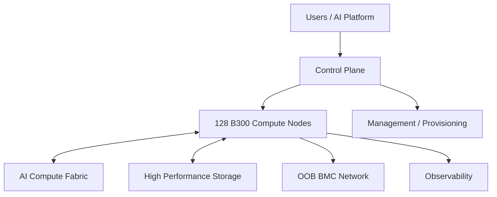

# 01｜128 节点总体架构

## 基线
- 128 × 8-GPU B300 compute nodes
- 1,024 GPUs
- 初步按 4 × 32-node Scaling Unit 研究
- 网络、供电、冷却、IP 和空间预留扩容

## 六个平面

至少逻辑区分 Compute Fabric、Storage Fabric、In-band Management/Service、OOB/BMC、Provisioning、External/User Access。

按 32 节点标准单元规划，便于分批上线、故障域控制、复制布线、独立验收和未来扩容。
