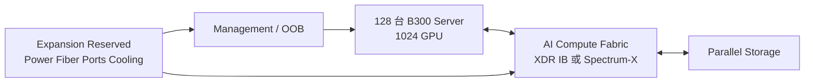

# 08｜128 节点 / 1,024 GPU 设计实例

> 本文用于 AI 小白学习和容量规划。**128 台 B300 ≠ 128 张 GPU**。
>
> 当前项目基线：128 台 NVIDIA B300 服务器节点，每台 8 GPU，合计 1,024 GPU。具体 OEM 配置、网络设备数量和机房容量需要以最终 NVIDIA/OEM 设计文件确认。

| 项目 | Baseline |
|---|---|
| Server nodes | 128 台 B300 节点 |
| GPUs/node | 8 GPU（需以最终 B300 OEM 配置确认） |
| Total GPUs | 1,024 GPU |
| Expansion target | 预留扩展能力（例如 144/256+ 节点，具体待确认） |
| Compute fabric | XDR InfiniBand / Spectrum-X Ethernet（二选一，待项目确认） |
| Storage | Parallel Storage（容量与性能待 workload 确认） |
| Scheduler | Slurm / Kubernetes / Hybrid（待确认） |

## 重要口径说明

历史资料中可能出现不同 SU（Scalable Unit）划分方式：

- 不同 NVIDIA 产品线、网络架构和文档版本可能采用不同 SU 定义。
- XDR InfiniBand B300 参考架构可按 72-node SU 进行容量规划。
- Spectrum-X Ethernet B300 参考架构可按 64-node SU 进行容量规划。
- 本项目不把 128 台服务器自动转换为 128 GPU，也不固定采用旧的 4×32 节点模型。

最终 SU 划分、Leaf/Spine 数量、800G 链路数量必须以选定 NVIDIA Reference Architecture 和网络 BOM 为准。

## 推荐规划思路

## Day-1 扩容预留

机房和网络设计阶段提前考虑：

- 高密度机柜空间
- 电力容量和配电路径
- 制冷能力（风冷/液冷方案待确认）
- 800G 光纤路径和备用芯数
- Compute Fabric radix 扩展空间
- Storage 扩容空间
- Management/OOB 地址规划
- 固件和软件基线管理

## 待确认项

以下内容不能在没有正式设计文件时直接固定：

- B300 最终服务器 OEM 形态
- 每柜服务器数量
- 精确机柜数量
- CDU/RDHx/液冷设施型号
- Leaf/Spine 具体型号和数量
- Storage 容量、带宽和协议
- 256/512 节点扩展路径
