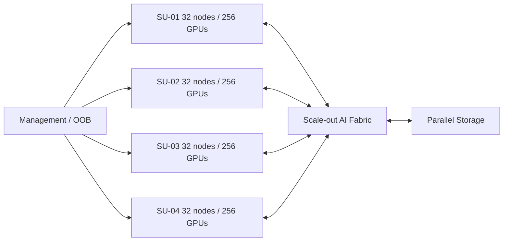

# 08｜128 节点 / 1,024 GPU 设计实例

| 项目 | Baseline |
|---|---|
| Compute nodes | 128 |
| GPUs/node | 8 |
| Total GPUs | 1,024 |
| Logical SU | 4 × 32 nodes |
| Compute fabric | TBD: XDR InfiniBand / Spectrum-X Ethernet |
| Storage | TBD |
| Scheduler | TBD: Slurm / Kubernetes / hybrid |
| Cooling | 以选定 OEM 为准 |
| Expansion | Day-1 考虑 256+ nodes |

Day-1 预留：spine/core radix、ports、fiber trunks、rack rows、电力、CDU/水系统、IP/ASN、storage、control-plane、monitoring retention、spares。
